# 基于Springboot的在线考试系统

## Springboot-0072


## 技术栈

Springboot mybatisplus vue mysql maven


## 数据库表(14张)


## 功能介绍

```properties
管理员功能有个人中心，用户管理，考试统计管理，专业列表管理，专业类型管理，考试规则管理，忘记密码人员登记管理，考试评分管理，试卷管理，试题管理，系统管理，考试管理等。

用户功能有，查看考试规则，试卷列表，考试资讯，参加考试，考试记录，错题本，考试评分
```


## 图片

### 前台


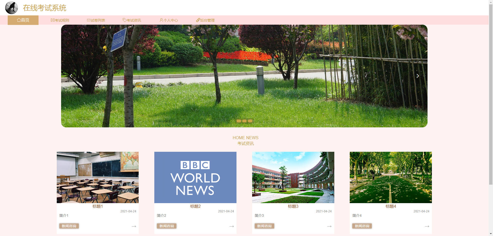


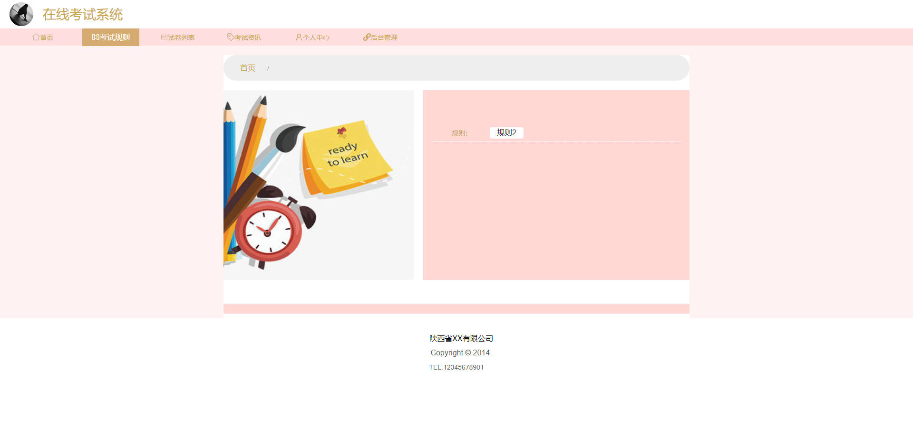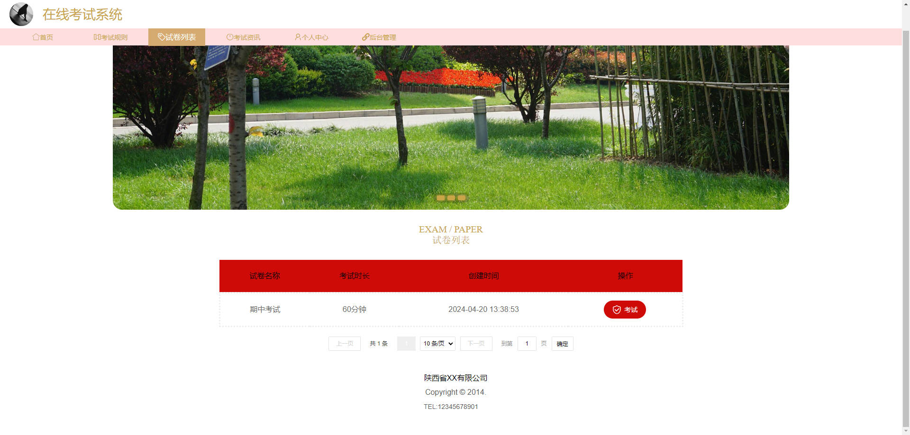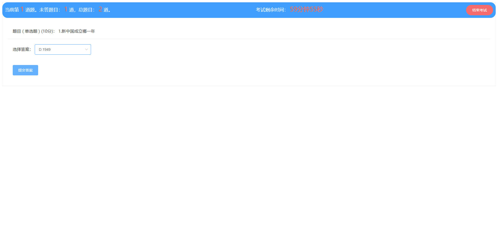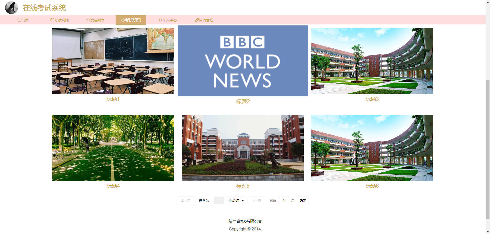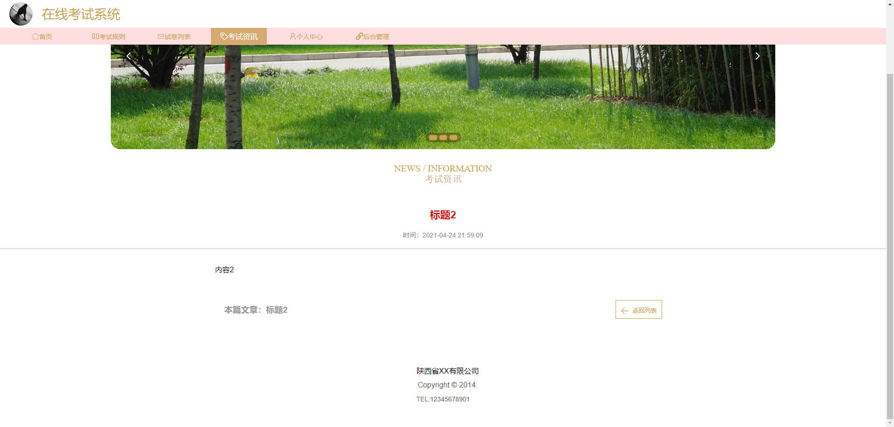

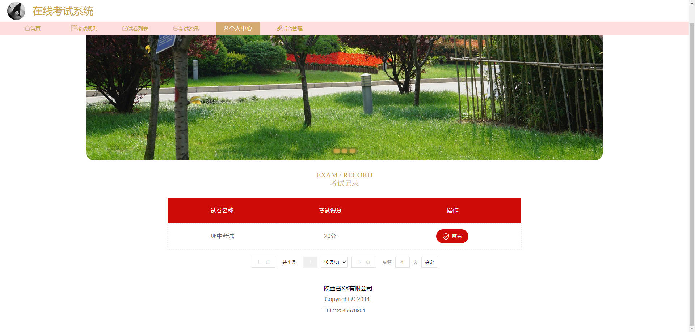

### 后台


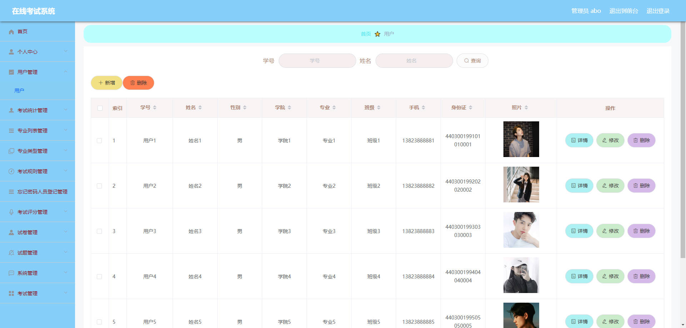

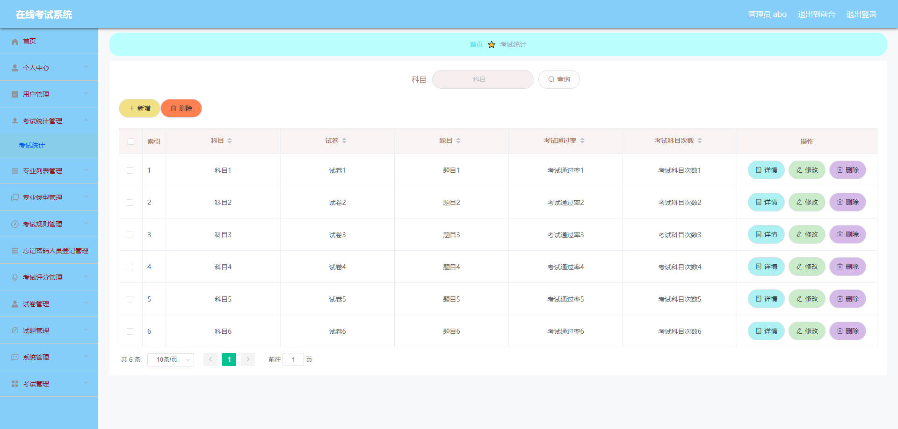

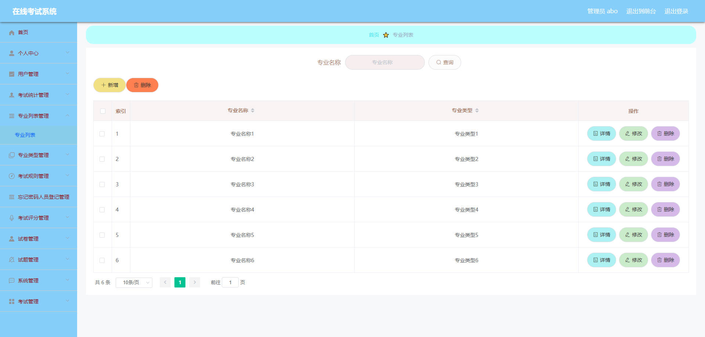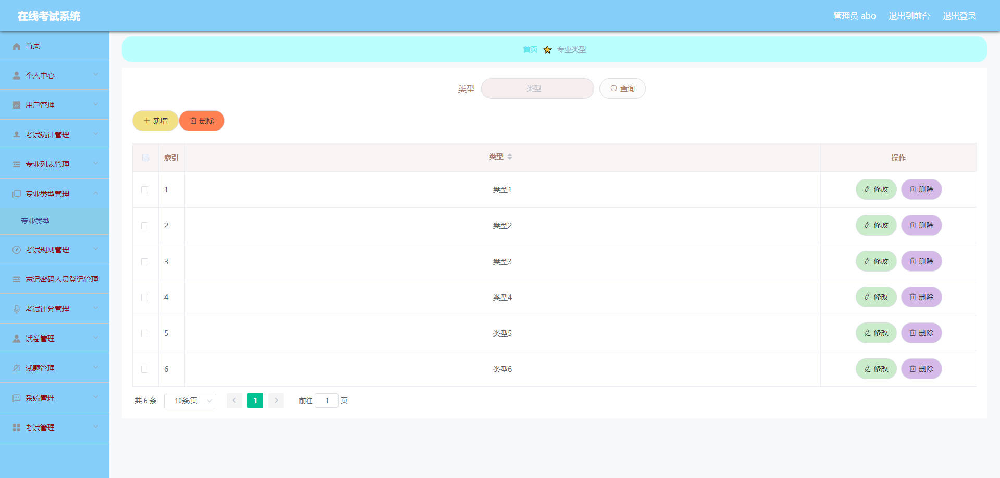

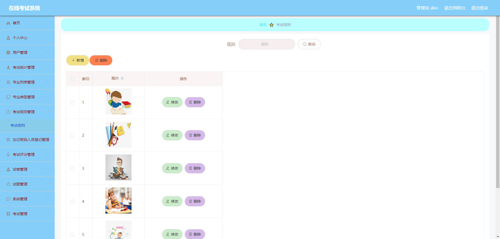

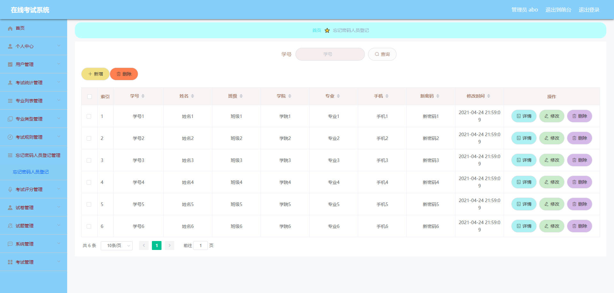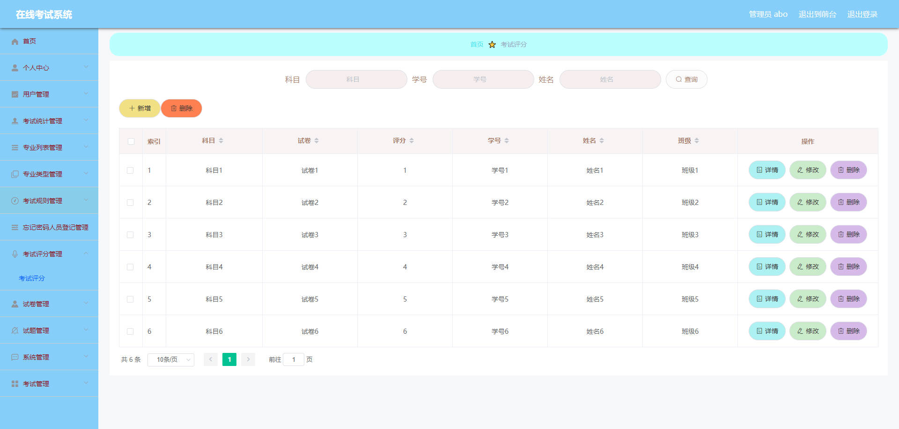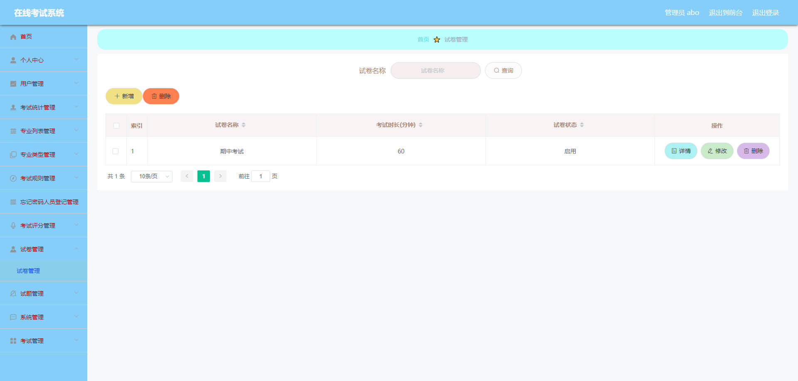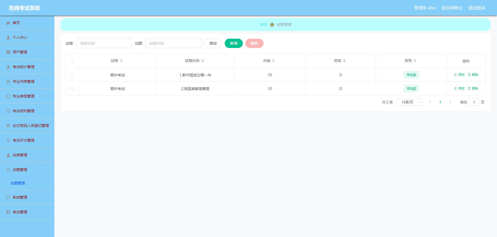

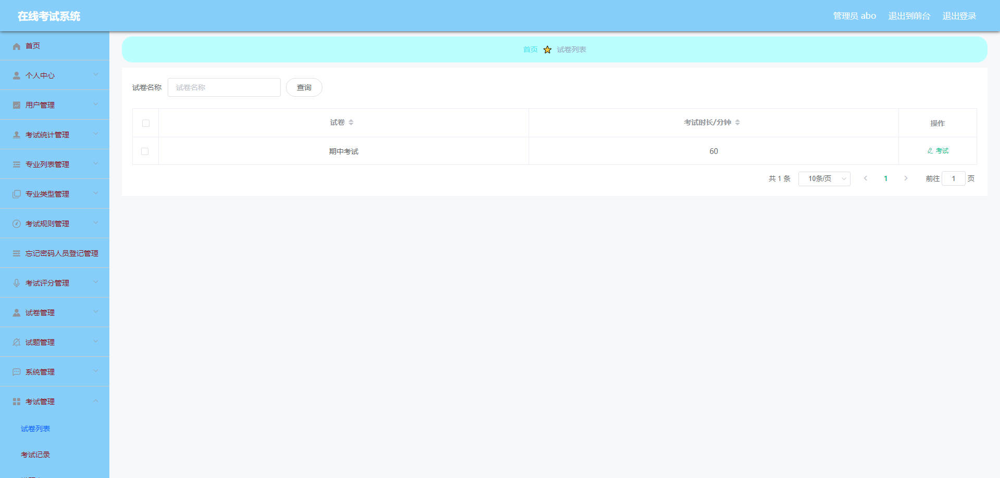

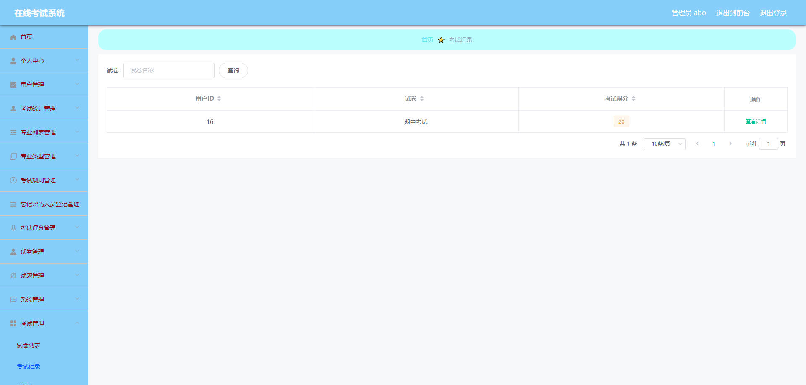


## 访问路径

### 前台

```properties
http://localhost:8080/springbootsu39z/front/pages/login/login.html

账号 用户6
密码 123456
```

### 后台

```properties
http://localhost:8080/springbootsu39z/admin/dist/index.html#/login

账号 abo
密码 abo
```


## 功能图

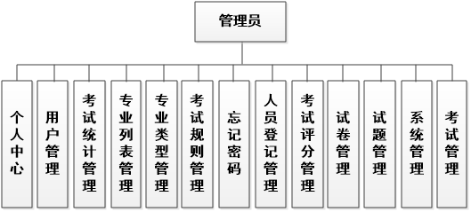

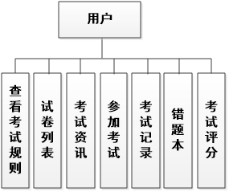

## 文档目录

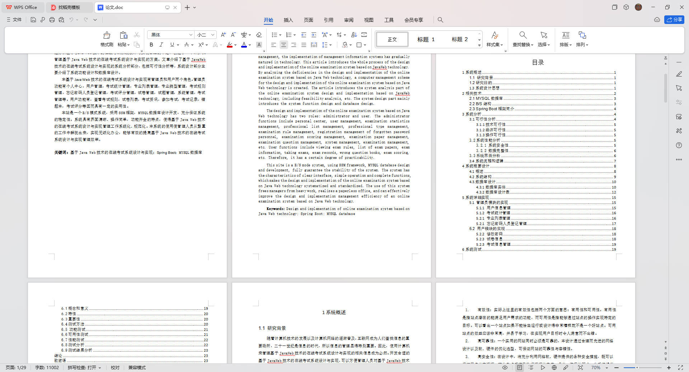


## 打赏或交流


